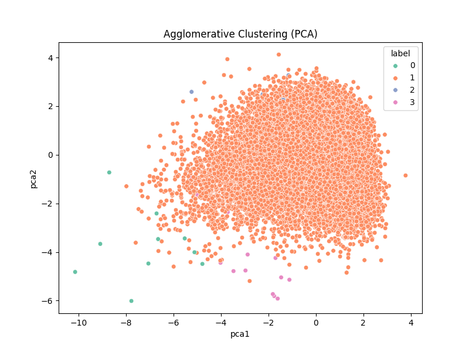

# 🎵 PlaylistGenerator

A mood-based playlist generator that uses **machine learning** and **Spotify API** to create personalized playlists based on **audio features** like danceability, tempo, and genre. Built using **React**, **Express**, and **Python-based clustering models**.



---

## 🚀 Features

- 🎧 **Mood-based filtering** (Chill, Happy, Energetic, Sad)
- 🎼 **Genre & BPM-based filtering**
- 🔀 **Random song sampling** within filters
- ✅ **Spotify playlist creation** via access token
- 📊 Built on top of **Agglomerative Clustering**, the best performing model after comparing with KMeans and DBSCAN
- 📂 Responsive frontend with elegant styling using Tailwind CDN

---

## 🧠 Tech Stack

| Frontend      | Backend       | ML + Clustering | Database |
|---------------|---------------|------------------|----------|
| React (Vite)  | Express.js    | scikit-learn (Python) | Firebase (optional future) |

---

## 📚 Data Mining Approach

- Used a **Kaggle Spotify audio dataset**
- Cleaned & scaled the data
- Applied **Agglomerative Clustering (n=4)** based on:
  - `danceability`, `energy`, `loudness`, `valence`, `tempo`, etc.
- Compared against **KMeans** and **DBSCAN**
- Best model selected using:
  - Silhouette Score
  - Davies-Bouldin Index

| Model         | Silhouette Score | Davies-Bouldin Index |
|---------------|------------------|-----------------------|
| KMeans        | 0.152            | 1.832                 |
| DBSCAN        | -0.230           | 1.360                 |
| Agglomerative | **0.464**        | **1.045**             |

---

## 📦 Installation

### 1. Clone the repo
```bash
git clone https://github.com/shauryeezy/PlaylistGenerator.git
cd PlaylistGenerator/my-vite-project
2) npm install
3)npm run dev
4)cd backend
npm install
node index.js

Create .env file
SPOTIFY_CLIENT_ID=your_id_here
SPOTIFY_CLIENT_SECRET=your_secret_here
